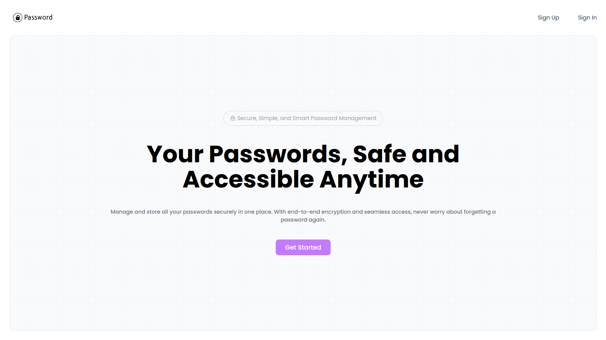
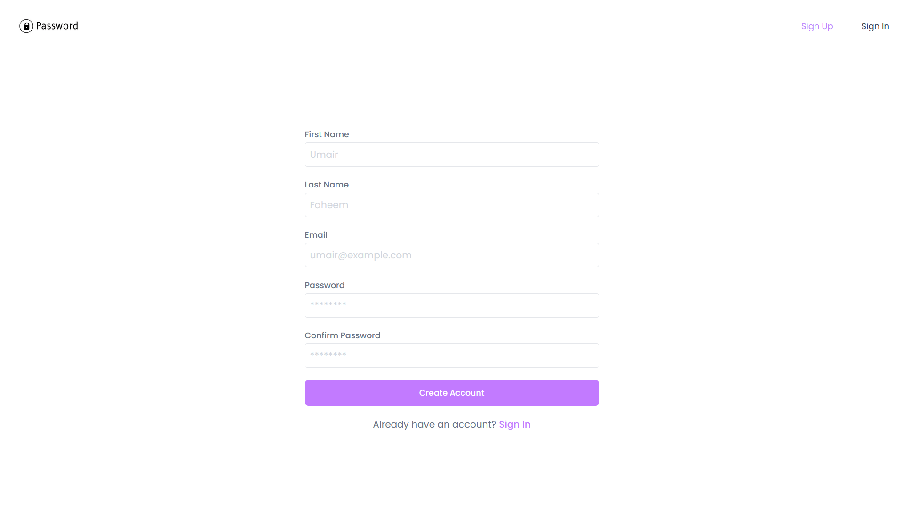
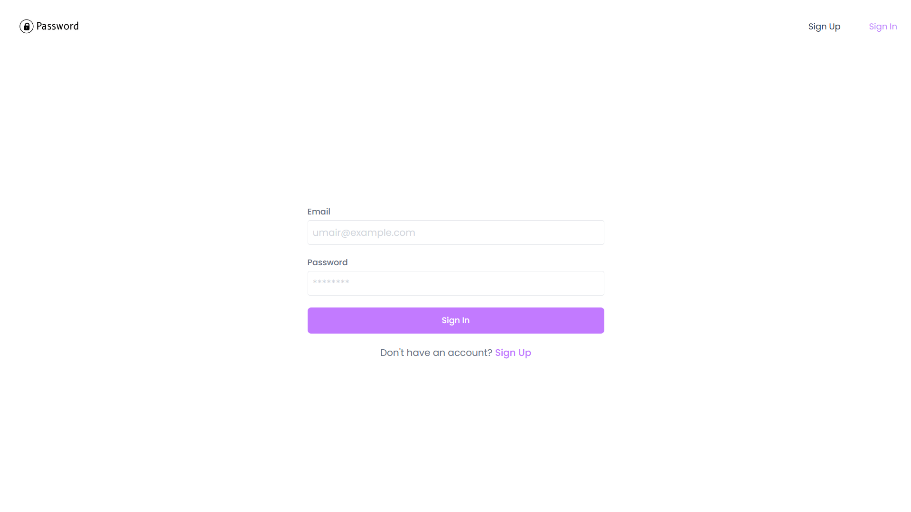
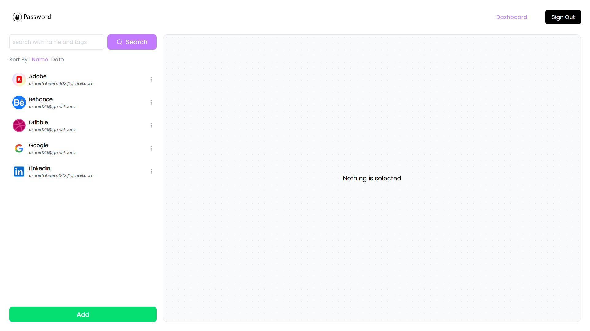
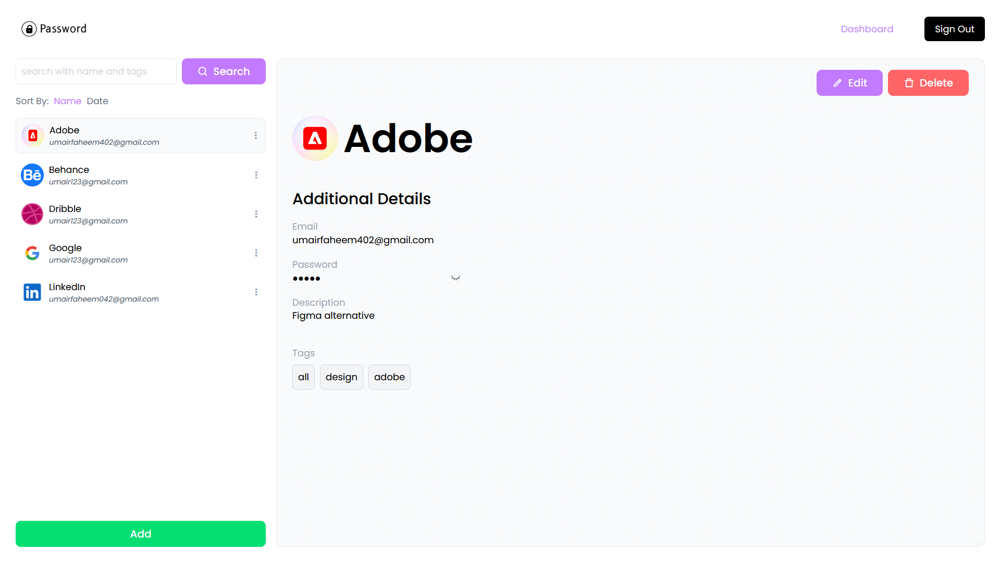
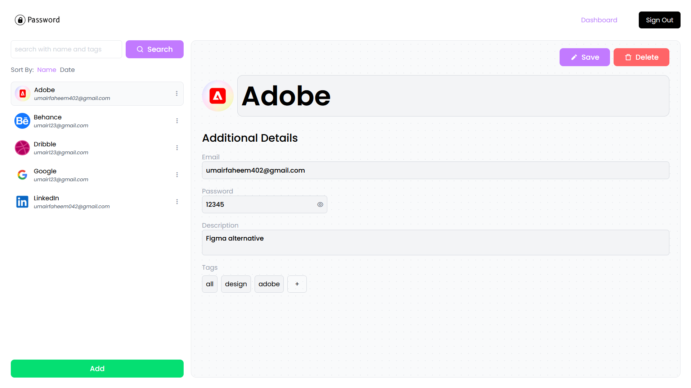
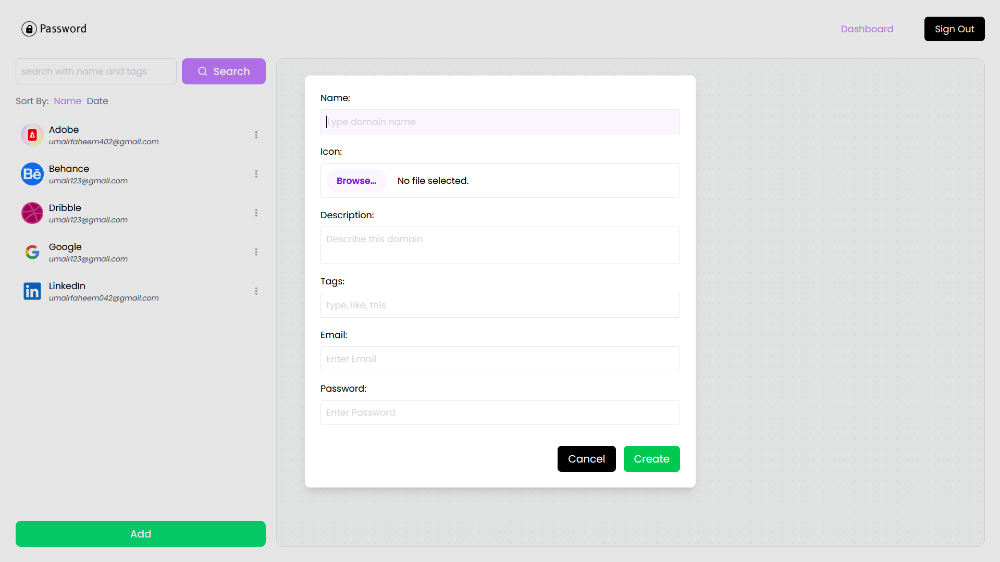

# Password Manager

---

## Introduction

The Password Manager is a web application designed to securely store and manage your passwords. It allows users to save their passwords with a user-friendly interface, the Password Manager makes it easy to organize and retrieve passwords for various accounts.

---

## Screenshots

---

## Technologies Used

- **Frontend:**

  - React
  - Tailwind CSS
  - React Toastify

- **Backend:**

  - Node.js
  - Express.js

- **Database:**

  - MongoDB

- **Security:**
  - bcrypt (for password hashing)
  - JSON Web Tokens (JWT) for authentication

---

## Contributing

Contributions are welcome! Please fork the repository and create a pull request with your changes.

---

## License

This project is licensed under the MIT License.
